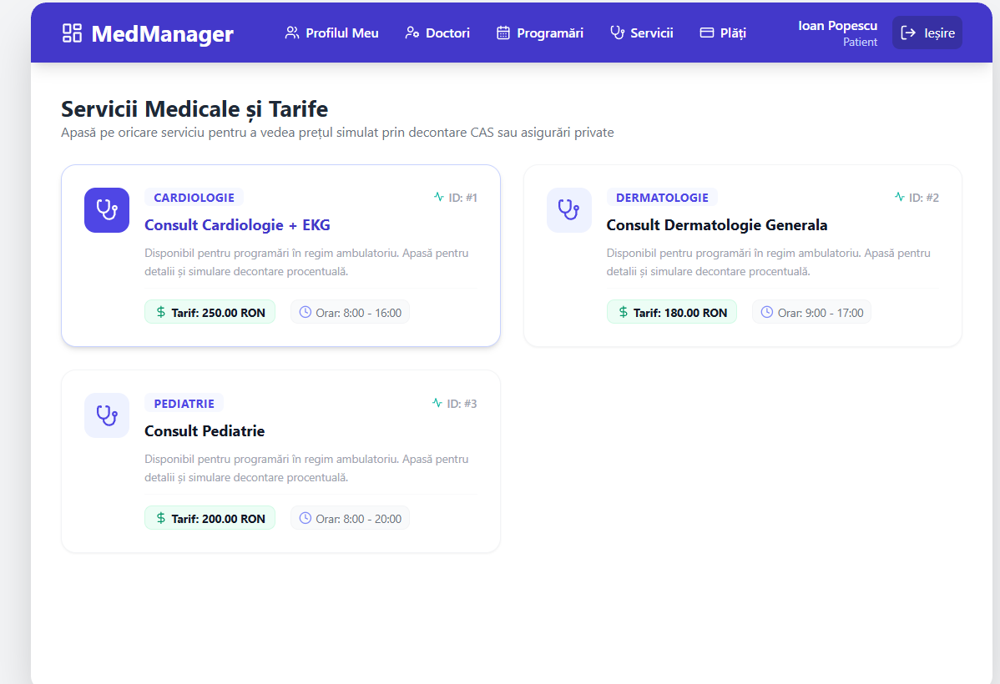
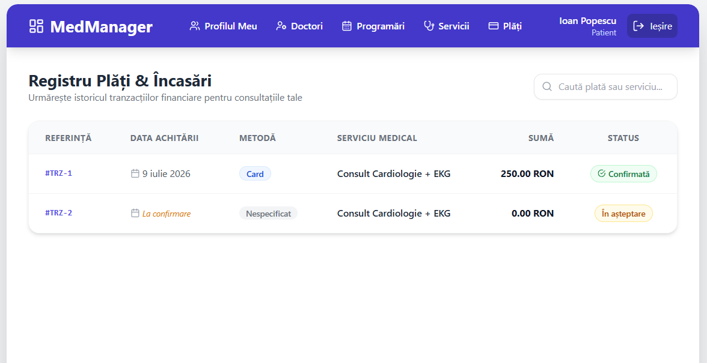
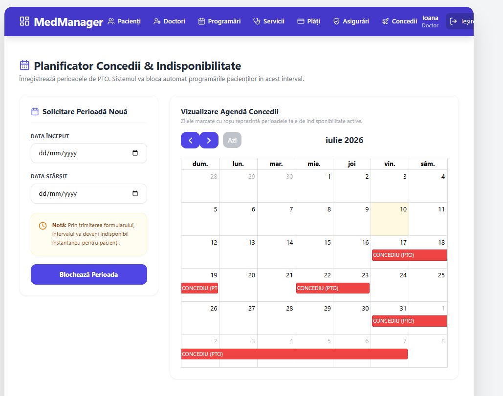

# proiectAWBD
Sistem de Programari Medicale
Este o platformă pentru gestiunea unei clinici mici private medicale care ajuta la creearea programarilor, vizualizarea informatiilor medicilor si pacientilor,
si procesarea teoretica a platilor.

**Cerințe funcționale**
1. Sistemul trebuie să permită înregistrarea și gestionarea profilurilor de pacient și de medic.
2. Sistemul trebuie să permită autentificarea utilizatorilor pe baza unui cont și a unui rol (pacient, medic sau administrator).
3. Sistemul trebuie să permită pacientului vizualizarea listei serviciilor medicale disponibile.
4. Sistemul trebuie să permită afișarea intervalelor orare disponibile pentru programarea unui serviciu medical.
5. Sistemul trebuie să permită crearea unei programări doar dacă intervalul selectat este disponibil.
6. Sistemul trebuie să împiedice efectuarea unei programări într-un interval ocupat, în afara programului medicului sau într-o perioadă de concediu.
7. Sistemul trebuie să permită pacientului vizualizarea tuturor programărilor sale.
8. Sistemul trebuie să permită medicului înregistrarea zilelor de concediu (PTO).
9. Sistemul trebuie să verifice existența programărilor înainte de aprobarea unei cereri de concediu și să respingă solicitarea dacă există consultații programate.
10. Sistemul trebuie să permită actualizarea statusului unei programări (de exemplu: Appointed, Completed, Cancelled).
11. Sistemul trebuie să genereze automat informațiile privind plata unei programări și să stabilească dacă aceasta este acoperită de asigurare sau abonament.
12. Sistemul trebuie să permită pacientului acordarea unui rating pentru serviciul medical doar după finalizarea consultației.
13. Sistemul trebuie să recalculeze automat ratingul mediu al unui serviciu medical după înregistrarea unui nou feedback.
14. Sistemul trebuie să returneze mesaje de eroare corespunzătoare atunci când o operație nu poate fi efectuată (de exemplu, programare invalidă, medic inexistent, pacient inexistent).
15. Sistemul trebuie să asigure accesul la funcționalități în funcție de rolul utilizatorului (pacient, medic, administrator).

Entități

Sistemul de management medical utilizează un model relațional complex format din 9 entități interconectate. Arhitectura bazei de date a fost concepută pentru a gestiona fluxul complet al unei clinici: de la autentificare și profiluri de utilizatori (Doctori/Pacienți), până la logica de programări, plăți și scheme de asigurare/abonament.

Relații @OneToOne
User => Patient / Doctor: Fiecare User este legat de un singur profil clinic. Acest lucru permite separarea datelor de autentificare de datele medicale.
Appointment => Payment: O programare are asociată o singură tranzacție financiară, asigurând trasabilitatea plăților.

Relații @ManyToOne/@OneToMany 
Doctor => MedicalService: Mai mulți doctori pot fi specializați pe același serviciu medical.
Patient => Appointment: Un pacient poate avea mai multe programări de-a lungul timpului.
Doctor => PaidTimeOff: Un doctor poate solicita mai multe perioade de concediu.
InsuranceProvider => Patient: Mai mulți pacienți pot fi arondați aceluiași furnizor de asigurări medicale.

Relație @ManyToMany
MedicalService => InsuranceProvider: Implementată prin tabelul de joncțiune SERVICE_INSURANCE_COVERAGE. Un serviciu medical poate fi acoperit de mai mulți asiguratori, iar un asigurator poate acoperi o gamă largă de servicii.

Diagrama ER


Diagrama conceptuala 


---

## Arhitectură microservicii

Monolitul a fost împărțit în 3 microservicii independente, în spatele unui Config Server, unui Eureka discovery server și unui Spring Cloud Gateway.

### Împărțirea responsabilităților
- **user-service** – autentificare (sesiune + BCrypt + remember-me + CSRF), utilizatori și roluri (`PATIENT`, `DOCTOR`).
- **medical-service** – entitățile clinice principale: `Doctor`, `Patient`, `MedicalService`, `Appointment`, `PaidTimeOff`, `InsuranceProvider`, `ServiceCoverage` (relații JPA de toate tipurile).
- **payment-service** – generarea și gestionarea plăților.

Legăturile JPA inter-serviciu au fost înlocuite cu coloane de ID (`Doctor/Patient.userId`, `Payment.appointmentId/patientId`), iar comunicarea reală se face prin **Feign**:
- `user-service ->  medical-service`: creare/căutare/ștergere profil.
- `medical-service ->  payment-service`: creare plată pentru o programare.
- `payment-service ->  medical-service`: `pricing-info` + `summary` pentru o programare.
- `medical-service ->  user-service`: ștergere cont intern.

### Securitate hibridă (II.6)
- **Browser -> gateway**: sesiune HTTP partajată prin **Spring Session Redis** + CSRF.
- **Serviciu -> serviciu (Feign)**: **JWT** semnat HMAC, emis dintr-un `RequestInterceptor` pe baza `SecurityContext`-ului și validat de un `SecurityFilterChain` `@Order(1)` pe `/api/internal/**` (stateless).

### Cerințe opționale acoperite
- **1 Config centralizat** – `config-server` (profil `native`), servicii client cu `spring.config.import`, `@RefreshScope` demo pe `GET /auth/info` + `POST /actuator/refresh`.
- **2 Service discovery + Feign** – Eureka + OpenFeign.
- **3 Load balancing** – Spring Cloud LoadBalancer (`lb://`); rulează 2 instanțe de `medical-service` (vezi mai jos).
- **4 API Gateway** – routing centralizat, `RequestRateLimiter` pe Redis + `GlobalFilter` de correlation-id/logging.
- **5 Monitorizare** – Actuator (`health,info,metrics,prometheus`) + Prometheus + Grafana (`docker-compose.yml`).
- **6 Resilience4j** – circuit breaker + retry + fallback pe apelurile Feign medical↔payment.

## Instructiuni de Rulare

### 1. Infrastructură
```bash
# Redis + Prometheus + Grafana
docker-compose up -d

# Bazele de date pe SQL Server (localhost\SQLEXPRESS01) create manual
#   Medical_User, Medical_Medical, Medical_Payment
```

### 2. Ordinea de pornire
```bash
# 1) Config Server
cd config-server   && mvn spring-boot:run
# 2) Eureka
cd discovery-server && mvn spring-boot:run
# 3) Gateway
cd api-gateway     && mvn spring-boot:run
# 4) Servicii
cd user-service    && mvn spring-boot:run
cd medical-service && mvn spring-boot:run
cd payment-service && mvn spring-boot:run
# 5) Frontend
cd frontend && npm install && npm run dev
```

### 3. Demo load balancing (a 2-a instanță de medical-service)
```bash
cd medical-service && mvn spring-boot:run -Dspring-boot.run.arguments=--server.port=8092
```
Ambele instanțe apar în Eureka (`http://localhost:8761`); apelurile Feign din payment-service se distribuie round-robin.

## Testare
Fiecare serviciu are teste unitare (Mockito) pe stratul de service + un test de context pe H2 (profil `test`, fără Redis/Eureka/Config):
```bash
cd user-service    && mvn test
cd medical-service && mvn test
cd payment-service && mvn test
```

## Verificare rapidă
- Eureka: `http://localhost:8761`
- Config servit: `http://localhost:8888/user-service/default`
- Refresh dinamic: modifică `app.message` în config → `POST http://localhost:8081/actuator/refresh` → `GET http://localhost:8081/auth/info`
- Prometheus: `http://localhost:9090` (ținte `UP`), Grafana: `http://localhost:3000` (admin/admin)
- Rate limit: burst pe o rută a gateway-ului → `429 Too Many Requests`
- Resilience: oprește `payment-service`, creează o programare → fallback (plată `UNAVAILABLE`) în loc de eroare
- Flux end-to-end: register → login → create appointment → payment, prin gateway

## Screenshots







Contributia: 100% Florea Ioana-Cristina
